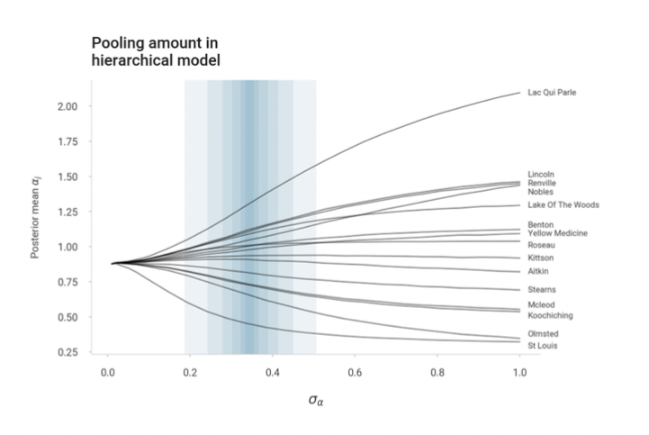

# A practical introduction to Bayesian hierarchical modelling
This is the supporting material for a talk (webinar?) I gave on June 2021 about hierarchical models. A recording of the talk can be found in this link: https://www.youtube.com/watch?v=38yOWMMCeMk 

If you find any mistakes in the material or have any recommendations, I am open to suggestions/comments.
